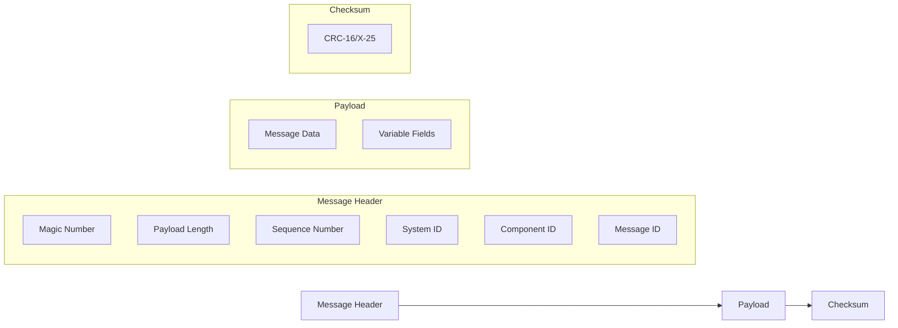
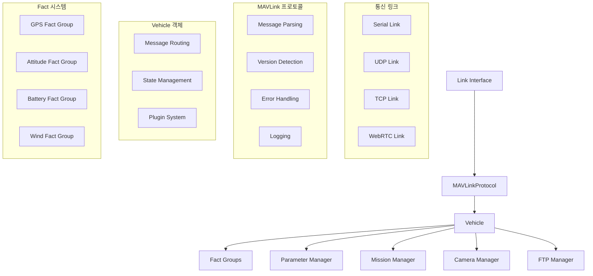
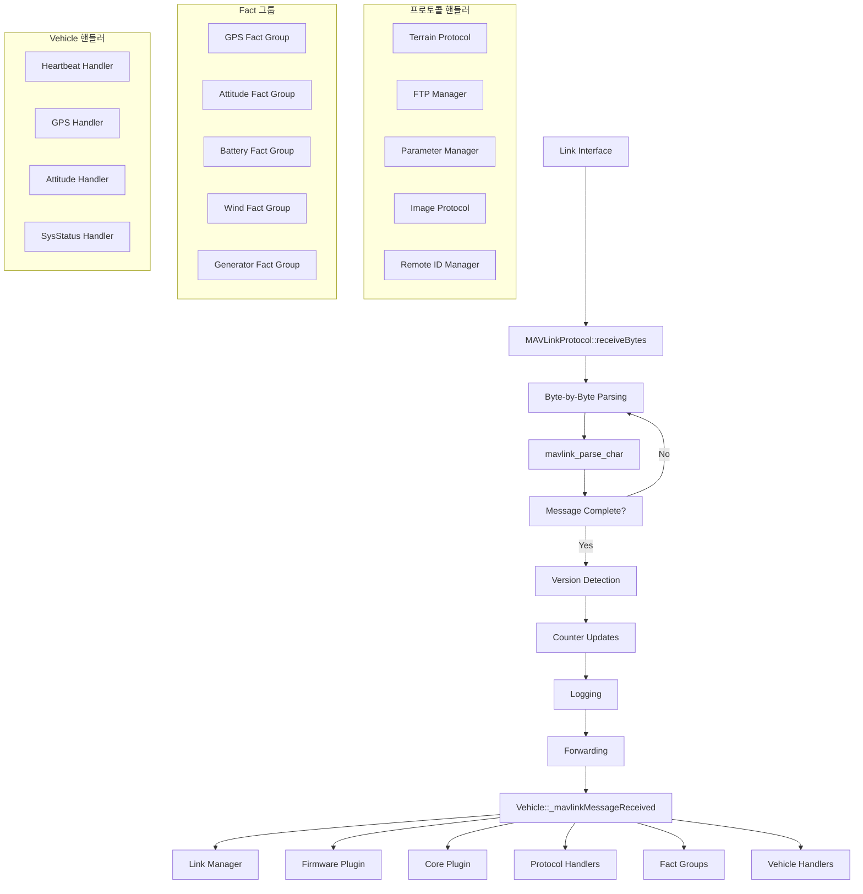
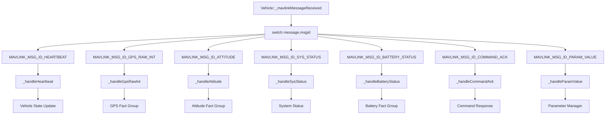
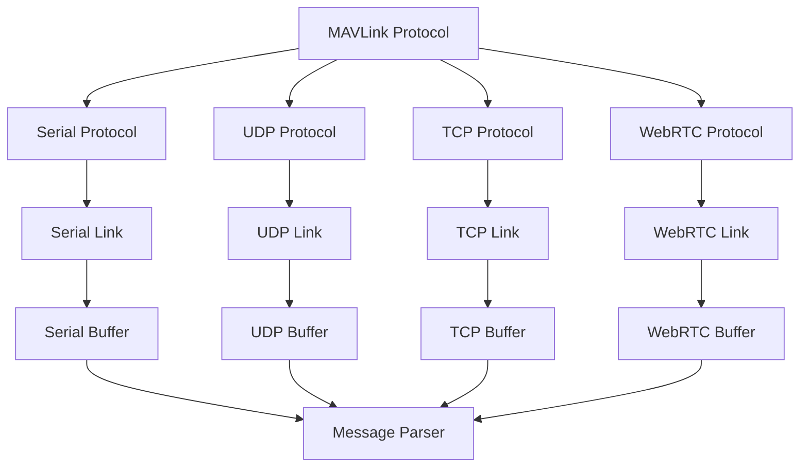
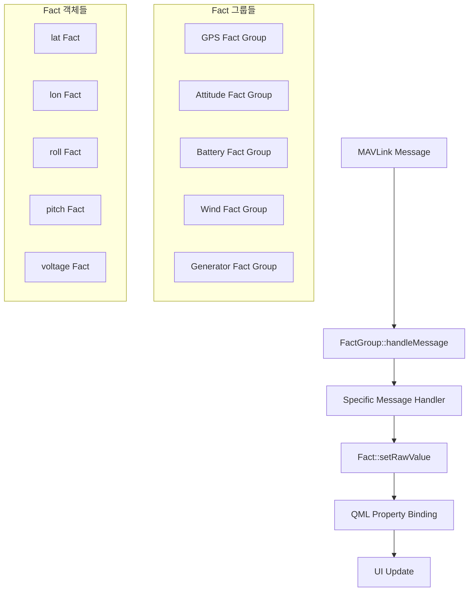

# QGroundControl MAVLink 데이터 처리 분석 및 가이드

## 목차
1. [MAVLink 개요](#mavlink-개요)
2. [MAVLink 메시지 구조](#mavlink-메시지-구조)
3. [QGC MAVLink 처리 아키텍처](#qgc-mavlink-처리-아키텍처)
4. [데이터 처리 파이프라인](#데이터-처리-파이프라인)
5. [메시지 타입별 처리](#메시지-타입별-처리)
6. [통신 프로토콜](#통신-프로토콜)
7. [에러 처리 및 복구](#에러-처리-및-복구)
8. [성능 최적화](#성능-최적화)
9. [QGC 실제 구현 분석](#qgc-실제-구현-분석)
10. [Fact 시스템](#fact-시스템)

---

## MAVLink 개요

### MAVLink란?
MAVLink(Micro Air Vehicle Link)는 드론, 로봇, 지상 관제 시스템 간의 통신을 위한 경량화된 메시징 프로토콜입니다.

### 주요 특징
- **경량화**: 최소한의 오버헤드로 효율적인 통신
- **확장성**: 커스텀 메시지 지원
- **호환성**: 다양한 플랫폼 지원
- **실시간성**: 저지연 통신 지원

### QGroundControl에서의 MAVLink 지원
QGroundControl은 MAVLink 프로토콜의 완전한 구현을 제공하며, 다음과 같은 특징을 가집니다:

- **MAVLink 1.0/2.0 호환**: 자동 버전 감지 및 전환
- **all.xml 다이얼렉트**: 모든 MAVLink 메시지 지원
- **PX4/ArduPilot 호환**: 두 주요 펌웨어 모두 지원
- **실시간 로깅**: MAVLink 2 로그 스트리밍 지원
- **다중 링크**: 여러 통신 채널 동시 지원

---

## MAVLink 메시지 구조

### 기본 메시지 구조



### 메시지 헤더 상세

| 필드 | 크기 | 설명 |
|------|------|------|
| **Magic Number** | 1 byte | MAVLink 1.0: 0xFE, MAVLink 2.0: 0xFD |
| **Payload Length** | 1 byte | 페이로드 길이 (0-255 bytes) |
| **Sequence Number** | 1 byte | 메시지 시퀀스 번호 (0-255) |
| **System ID** | 1 byte | 시스템 식별자 |
| **Component ID** | 1 byte | 컴포넌트 식별자 |
| **Message ID** | 1 byte | 메시지 타입 식별자 |

### MAVLink 1.0 vs 2.0 비교

| 특성 | MAVLink 1.0 | MAVLink 2.0 |
|------|-------------|-------------|
| **Magic Number** | 0xFE | 0xFD |
| **최대 페이로드** | 255 bytes | 255 bytes |
| **시그니처** | 없음 | 13 bytes (선택적) |
| **호환성** | 기본 | 하위 호환 |
| **보안** | 없음 | 서명 지원 |

---

## QGC MAVLink 처리 아키텍처

### 전체 시스템 구조



### 핵심 클래스 구조

#### 1. **MAVLinkProtocol 클래스**
```cpp
class MAVLinkProtocol : public QObject {
    Q_OBJECT
    
public:
    static MAVLinkProtocol *instance();
    void receiveBytes(LinkInterface *link, const QByteArray &data);
    void logSentBytes(const LinkInterface *link, const QByteArray &data);
    
signals:
    void messageReceived(LinkInterface *link, const mavlink_message_t &message);
    void vehicleHeartbeatInfo(LinkInterface *link, int vehicleId, int componentId, 
                             int vehicleFirmwareType, int vehicleType);
    
private:
    void _updateVersion(LinkInterface *link, uint8_t mavlinkChannel);
    void _updateCounters(uint8_t mavlinkChannel, const mavlink_message_t &message);
    void _logData(LinkInterface *link, const mavlink_message_t &message);
    void _forward(const mavlink_message_t &message);
};
```

#### 2. **Vehicle 클래스**
```cpp
class Vehicle : public QObject {
    Q_OBJECT
    
public:
    void _mavlinkMessageReceived(LinkInterface* link, mavlink_message_t message);
    
private:
    void _handleHeartbeat(const mavlink_message_t &message);
    void _handleGpsRawInt(const mavlink_message_t &message);
    void _handleAttitude(const mavlink_message_t &message);
    void _handleSysStatus(const mavlink_message_t &message);
    
    // Fact Groups
    QList<FactGroup*> factGroups();
    VehicleGPSFactGroup* _gpsFactGroup;
    VehicleFactGroup* _vehicleFactGroup;
    VehicleBatteryFactGroup* _batteryFactGroup;
};
```

#### 3. **LinkInterface 클래스**
```cpp
class LinkInterface : public QObject {
    Q_OBJECT
    
public:
    virtual void writeBytesThreadSafe(const char* bytes, int length) = 0;
    virtual uint8_t mavlinkChannel() const = 0;
    virtual bool isConnected() const = 0;
    
signals:
    void bytesReceived(LinkInterface* link, const QByteArray& bytes);
};
```

### 메시지 처리 흐름

```mermaid
sequenceDiagram
    participant Link as LinkInterface
    participant Protocol as MAVLinkProtocol
    participant Vehicle as Vehicle
    participant Facts as FactGroups
    participant UI as UserInterface
    
    Link->>Protocol: bytesReceived(data)
    Protocol->>Protocol: mavlink_parse_char()
    Protocol->>Protocol: _updateVersion()
    Protocol->>Protocol: _updateCounters()
    Protocol->>Protocol: _logData()
    Protocol->>Vehicle: messageReceived(link, message)
    
    Vehicle->>Vehicle: _mavlinkMessageReceived()
    Vehicle->>Vehicle: _vehicleLinkManager->mavlinkMessageReceived()
    Vehicle->>Vehicle: _updateCounters()
    Vehicle->>Vehicle: _firmwarePlugin->adjustIncomingMavlinkMessage()
    
    loop Fact Groups
        Vehicle->>Facts: factGroup->handleMessage()
        Facts->>Facts: _handleSpecificMessage()
        Facts->>Facts: fact->setRawValue()
    end
    
    Vehicle->>Vehicle: handleMessage()
    Vehicle->>UI: mavlinkMessageReceived()
```

---

## 데이터 처리 파이프라인

### QGC 데이터 처리 흐름



### QGC 메시지 처리 단계

#### 1. **바이트 단위 파싱 (Byte-by-Byte Parsing)**
```cpp
// MAVLinkProtocol::receiveBytes() - 실제 QGC 구현
void MAVLinkProtocol::receiveBytes(LinkInterface *link, const QByteArray &data) {
    for (const uint8_t &byte: data) {
        const uint8_t mavlinkChannel = link->mavlinkChannel();
        mavlink_message_t message{};
        mavlink_status_t status{};

        if (mavlink_parse_char(mavlinkChannel, byte, &message, &status) != MAVLINK_FRAMING_OK) {
            continue; // 불완전한 메시지, 다음 바이트 대기
        }

        // 완전한 메시지가 파싱됨
        _updateVersion(link, mavlinkChannel);
        _updateCounters(mavlinkChannel, message);
        _logData(link, message);
        
        emit messageReceived(link, message);
    }
}
```

#### 2. **버전 감지 및 전환 (Version Detection)**
```cpp
// MAVLinkProtocol::_updateVersion() - 실제 QGC 구현
void MAVLinkProtocol::_updateVersion(LinkInterface *link, uint8_t mavlinkChannel) {
    if (link->decodedFirstMavlinkPacket()) {
        return;
    }

    link->setDecodedFirstMavlinkPacket(true);
    const mavlink_status_t *const mavlinkStatus = mavlink_get_channel_status(mavlinkChannel);

    if (mavlinkStatus->flags & MAVLINK_STATUS_FLAG_IN_MAVLINK1) {
        return;
    }

    // MAVLink 2.0 패킷 감지 시 자동 전환
    if (mavlink_get_proto_version(mavlinkChannel) == 1) {
        qCDebug(MAVLinkProtocolLog) << "Switching outbound to mavlink 2.0";
        setVersion(200);
    }
}
```

#### 3. **카운터 업데이트 (Counter Updates)**
```cpp
// MAVLinkProtocol::_updateCounters() - 실제 QGC 구현
void MAVLinkProtocol::_updateCounters(uint8_t mavlinkChannel, const mavlink_message_t &message) {
    _totalReceiveCounter[mavlinkChannel]++;

    uint8_t &lastSeq = _lastIndex[message.sysid][message.compid];
    const QPair<uint8_t,uint8_t> key(message.sysid, message.compid);
    
    uint8_t expectedSeq;
    if (!_firstMessageSeen.contains(key)) {
        _firstMessageSeen.insert(key);
        expectedSeq = message.seq;
    } else {
        expectedSeq = lastSeq + 1;
    }

    // 패킷 손실 계산
    uint64_t lostMessages;
    if (message.seq >= expectedSeq) {
        lostMessages = message.seq - expectedSeq;
    } else {
        lostMessages = static_cast<uint64_t>(message.seq) + 256ULL - expectedSeq;
    }
    _totalLossCounter[mavlinkChannel] += lostMessages;
    lastSeq = message.seq;

    // 손실률 계산
    const uint64_t totalSent = _totalReceiveCounter[mavlinkChannel] + _totalLossCounter[mavlinkChannel];
    const float currentLossPercent = (static_cast<double>(_totalLossCounter[mavlinkChannel]) / totalSent) * 100.0f;
    _runningLossPercent[mavlinkChannel] = (currentLossPercent + _runningLossPercent[mavlinkChannel]) * 0.5f;
}
```

#### 4. **Vehicle 메시지 라우팅 (Vehicle Message Routing)**
```cpp
// Vehicle::_mavlinkMessageReceived() - 실제 QGC 구현
void Vehicle::_mavlinkMessageReceived(LinkInterface* link, mavlink_message_t message) {
    // 시스템 ID 검증
    if (message.sysid != _id && message.sysid != 0) {
        if (!(message.msgid == MAVLINK_MSG_ID_RADIO_STATUS && _vehicleLinkManager->containsLink(link))) {
            return;
        }
    }

    // 링크 매니저 처리
    _vehicleLinkManager->mavlinkMessageReceived(link, message);

    // 카운터 업데이트
    _messagesReceived++;
    emit messagesReceivedChanged();

    // 펌웨어 플러그인 처리
    if (!_firmwarePlugin->adjustIncomingMavlinkMessage(this, &message)) {
        return;
    }

    // 코어 플러그인 처리
    if (!QGCCorePlugin::instance()->mavlinkMessage(this, link, message)) {
        return;
    }

    // 프로토콜 핸들러들 처리
    _terrainProtocolHandler->mavlinkMessageReceived(message);
    _ftpManager->_mavlinkMessageReceived(message);
    _parameterManager->mavlinkMessageReceived(message);
    _remoteIDManager->mavlinkMessageReceived(message);

    // Fact 그룹들 처리
    for (FactGroup* factGroup : factGroups()) {
        factGroup->handleMessage(this, message);
    }

    // Vehicle 핸들러 처리
    this->handleMessage(this, message);
}
```

---

## 메시지 타입별 처리

### QGC 메시지 핸들러 구조

QGroundControl은 메시지 타입별로 체계적인 핸들러 구조를 가지고 있습니다:



### 1. **시스템 메시지 (System Messages)**

#### HEARTBEAT 메시지
```cpp
// Vehicle::_handleHeartbeat() - 실제 QGC 구현
void Vehicle::_handleHeartbeat(const mavlink_message_t &message) {
    mavlink_heartbeat_t heartbeat;
    mavlink_msg_heartbeat_decode(&message, &heartbeat);

    // 펌웨어 타입 및 차량 타입 업데이트
    if (_firmwareType != heartbeat.autopilot || _vehicleType != heartbeat.type) {
        _firmwareType = static_cast<MAV_AUTOPILOT>(heartbeat.autopilot);
        _vehicleType = static_cast<MAV_TYPE>(heartbeat.type);
        
        // 펌웨어 플러그인 재설정
        _firmwarePlugin = FirmwarePluginManager::instance()->firmwarePluginForAutopilot(_firmwareType, _vehicleType);
        
        emit firmwareTypeChanged();
        emit vehicleTypeChanged();
    }

    // 비행 모드 업데이트
    _updateFlightMode(heartbeat.base_mode, heartbeat.custom_mode);
    
    // 시스템 상태 업데이트
    _updateSystemStatus(heartbeat.system_status);
    
    // 연결 상태 확인
    if (!_heardFrom) {
        _heardFrom = true;
        _compID = message.compid;
        _messageSeq = message.seq + 1;
    }
}
```

#### SYSTEM_TIME 메시지
```cpp
struct SystemTimeMessage {
    uint64_t time_unix_usec;    // Unix 시간 (마이크로초)
    uint32_t time_boot_ms;      // 부팅 후 경과 시간 (밀리초)
};

void processSystemTime(const SystemTimeMessage& msg) {
    // 시간 동기화
    synchronizeTime(msg.time_unix_usec);
    
    // 지연 시간 계산
    uint64_t current_time = getCurrentTime();
    uint64_t latency = current_time - msg.time_unix_usec;
    
    // 지연 시간 모니터링
    updateLatencyMetrics(latency);
}
```

### 2. **텔레메트리 메시지 (Telemetry Messages)**

#### ATTITUDE 메시지
```cpp
// VehicleFactGroup::_handleAttitude() - 실제 QGC 구현
void VehicleFactGroup::_handleAttitude(Vehicle *vehicle, const mavlink_message_t &message) {
    mavlink_attitude_t attitude;
    mavlink_msg_attitude_decode(&message, &attitude);

    // 자세 정보 업데이트 (라디안에서 도로 변환)
    roll()->setRawValue(qRadiansToDegrees(attitude.roll));
    pitch()->setRawValue(qRadiansToDegrees(attitude.pitch));
    heading()->setRawValue(qRadiansToDegrees(attitude.yaw));
    
    // 각속도 정보 업데이트
    rollRate()->setRawValue(qRadiansToDegrees(attitude.rollspeed));
    pitchRate()->setRawValue(qRadiansToDegrees(attitude.pitchspeed));
    yawRate()->setRawValue(qRadiansToDegrees(attitude.yawspeed));
    
    _setTelemetryAvailable(true);
}
```

#### GPS_RAW_INT 메시지
```cpp
// VehicleGPSFactGroup::_handleGpsRawInt() - 실제 QGC 구현
void VehicleGPSFactGroup::_handleGpsRawInt(const mavlink_message_t &message) {
    mavlink_gps_raw_int_t gpsRawInt{};
    mavlink_msg_gps_raw_int_decode(&message, &gpsRawInt);

    // GPS 위치 정보 업데이트 (Fact 시스템 사용)
    lat()->setRawValue(gpsRawInt.lat * 1e-7);
    lon()->setRawValue(gpsRawInt.lon * 1e-7);
    
    // 고도 정보 (밀리미터에서 미터로 변환)
    if (gpsRawInt.alt != 0) {
        altitude()->setRawValue(gpsRawInt.alt / 1000.0);
    }
    
    // GPS 품질 정보
    hdop()->setRawValue(gpsRawInt.eph / 100.0);  // 센티미터에서 미터로
    vdop()->setRawValue(gpsRawInt.epv / 100.0);
    
    // 속도 및 방향
    courseOverGround()->setRawValue(gpsRawInt.cog / 100.0);  // 센티미터에서 미터로
    
    // 위성 수
    count()->setRawValue(gpsRawInt.satellites_visible);
    
    // GPS 잠금 상태
    lock()->setRawValue(gpsRawInt.fix_type >= GPS_FIX_TYPE_3D);
    
    // MGRS 좌표 계산
    if (gpsRawInt.fix_type >= GPS_FIX_TYPE_3D) {
        QGeoCoordinate coord(lat()->rawValue().toDouble(), lon()->rawValue().toDouble());
        mgrs()->setRawValue(QGCGeo::convertGeoToMGRS(coord));
    }
    
    _setTelemetryAvailable(true);
}
```

### 3. **명령 메시지 (Command Messages)**

#### COMMAND_LONG 메시지
```cpp
struct CommandLongMessage {
    uint8_t target_system;
    uint8_t target_component;
    uint16_t command;        // MAV_CMD
    uint8_t confirmation;
    float param1;
    float param2;
    float param3;
    float param4;
    float param5;
    float param6;
    float param7;
};

void processCommandLong(const CommandLongMessage& msg) {
    switch (msg.command) {
        case MAV_CMD_NAV_TAKEOFF:
            handleTakeoffCommand(msg);
            break;
        case MAV_CMD_NAV_LAND:
            handleLandCommand(msg);
            break;
        case MAV_CMD_NAV_WAYPOINT:
            handleWaypointCommand(msg);
            break;
        case MAV_CMD_DO_SET_MODE:
            handleModeChangeCommand(msg);
            break;
        default:
            handleUnknownCommand(msg);
            break;
    }
}
```

### 4. **파라미터 메시지 (Parameter Messages)**

#### PARAM_VALUE 메시지
```cpp
struct ParamValueMessage {
    float param_value;
    uint16_t param_count;
    uint16_t param_index;
    char param_id[16];
    uint8_t param_type;
};

void processParamValue(const ParamValueMessage& msg) {
    // 파라미터 값 업데이트
    updateParameter(msg.param_id, msg.param_value, msg.param_type);
    
    // 파라미터 목록 관리
    updateParameterList(msg.param_index, msg.param_count);
    
    // 파라미터 유효성 검사
    validateParameter(msg.param_id, msg.param_value);
}
```

---

## 통신 프로토콜

### 다중 프로토콜 지원



### 프로토콜별 특성

| 프로토콜 | 지연시간 | 신뢰성 | 대역폭 | 사용 사례 |
|----------|----------|--------|--------|-----------|
| **Serial** | 낮음 | 높음 | 제한적 | 직접 연결 |
| **UDP** | 낮음 | 낮음 | 높음 | 실시간 텔레메트리 |
| **TCP** | 높음 | 높음 | 높음 | 파일 전송, 설정 |
| **WebRTC** | 중간 | 높음 | 높음 | 웹 기반 제어 |

### 버퍼 관리

```cpp
class MavlinkBuffer {
private:
    static const size_t BUFFER_SIZE = 2048;
    uint8_t buffer[BUFFER_SIZE];
    size_t read_pos;
    size_t write_pos;
    std::mutex buffer_mutex;

public:
    bool write(const uint8_t* data, size_t length) {
        std::lock_guard<std::mutex> lock(buffer_mutex);
        
        if (availableSpace() < length) {
            return false; // 버퍼 오버플로우
        }
        
        for (size_t i = 0; i < length; i++) {
            buffer[write_pos] = data[i];
            write_pos = (write_pos + 1) % BUFFER_SIZE;
        }
        
        return true;
    }
    
    size_t read(uint8_t* data, size_t max_length) {
        std::lock_guard<std::mutex> lock(buffer_mutex);
        
        size_t available = availableData();
        size_t to_read = std::min(available, max_length);
        
        for (size_t i = 0; i < to_read; i++) {
            data[i] = buffer[read_pos];
            read_pos = (read_pos + 1) % BUFFER_SIZE;
        }
        
        return to_read;
    }
};
```

---

## 에러 처리 및 복구

### 에러 타입별 처리

#### 1. **통신 에러**
```cpp
enum CommunicationError {
    TIMEOUT_ERROR,
    CHECKSUM_ERROR,
    FRAME_ERROR,
    BUFFER_OVERFLOW,
    CONNECTION_LOST
};

void handleCommunicationError(CommunicationError error) {
    switch (error) {
        case TIMEOUT_ERROR:
            // 재연결 시도
            attemptReconnection();
            break;
        case CHECKSUM_ERROR:
            // 메시지 재요청
            requestMessageRetransmission();
            break;
        case FRAME_ERROR:
            // 버퍼 초기화
            resetBuffer();
            break;
        case BUFFER_OVERFLOW:
            // 버퍼 정리
            clearBuffer();
            break;
        case CONNECTION_LOST:
            // 연결 복구
            recoverConnection();
            break;
    }
}
```

#### 2. **메시지 에러**
```cpp
enum MessageError {
    UNKNOWN_MESSAGE_ID,
    INVALID_MESSAGE_LENGTH,
    INVALID_PARAMETER_VALUE,
    MESSAGE_TOO_OLD
};

void handleMessageError(MessageError error, const MavlinkMessage& msg) {
    // 에러 로깅
    logMessageError(error, msg);
    
    // 에러 통계 업데이트
    updateErrorStatistics(error);
    
    // 필요시 메시지 재요청
    if (error == INVALID_MESSAGE_LENGTH) {
        requestMessageRetransmission(msg.message_id);
    }
}
```

### 자동 복구 메커니즘

```cpp
class AutoRecovery {
private:
    static const int MAX_RETRY_COUNT = 3;
    static const int RETRY_DELAY_MS = 1000;
    
    int retry_count;
    std::chrono::steady_clock::time_point last_error_time;

public:
    bool attemptRecovery(CommunicationError error) {
        auto now = std::chrono::steady_clock::now();
        
        // 에러 간격 확인
        if (now - last_error_time < std::chrono::milliseconds(RETRY_DELAY_MS)) {
            return false;
        }
        
        if (retry_count < MAX_RETRY_COUNT) {
            retry_count++;
            last_error_time = now;
            
            // 복구 시도
            return performRecovery(error);
        }
        
        // 최대 재시도 횟수 초과
        return false;
    }
    
private:
    bool performRecovery(CommunicationError error) {
        switch (error) {
            case CONNECTION_LOST:
                return reconnect();
            case BUFFER_OVERFLOW:
                return resetBuffers();
            default:
                return false;
        }
    }
};
```

---

## 성능 최적화

### 메시지 우선순위 처리

```cpp
enum MessagePriority {
    PRIORITY_CRITICAL = 0,    // 명령, 제어 메시지
    PRIORITY_HIGH = 1,        // 텔레메트리, 상태
    PRIORITY_NORMAL = 2,      // 일반 데이터
    PRIORITY_LOW = 3          // 로깅, 디버그
};

class PriorityQueue {
private:
    std::priority_queue<MavlinkMessage> queue;
    std::mutex queue_mutex;

public:
    void enqueue(const MavlinkMessage& msg) {
        std::lock_guard<std::mutex> lock(queue_mutex);
        queue.push(msg);
    }
    
    bool dequeue(MavlinkMessage& msg) {
        std::lock_guard<std::mutex> lock(queue_mutex);
        
        if (queue.empty()) {
            return false;
        }
        
        msg = queue.top();
        queue.pop();
        return true;
    }
};
```

### 메모리 풀링

```cpp
template<typename T>
class ObjectPool {
private:
    std::vector<std::unique_ptr<T>> pool;
    std::queue<T*> available;
    std::mutex pool_mutex;

public:
    ObjectPool(size_t size) {
        for (size_t i = 0; i < size; i++) {
            auto obj = std::make_unique<T>();
            available.push(obj.get());
            pool.push_back(std::move(obj));
        }
    }
    
    T* acquire() {
        std::lock_guard<std::mutex> lock(pool_mutex);
        
        if (available.empty()) {
            return nullptr;
        }
        
        T* obj = available.front();
        available.pop();
        return obj;
    }
    
    void release(T* obj) {
        std::lock_guard<std::mutex> lock(pool_mutex);
        available.push(obj);
    }
};
```

### 배치 처리

```cpp
class BatchProcessor {
private:
    std::vector<MavlinkMessage> batch;
    size_t max_batch_size;
    std::chrono::milliseconds max_wait_time;

public:
    void processBatch() {
        if (batch.empty()) {
            return;
        }
        
        // 배치 크기 또는 시간 기준으로 처리
        if (batch.size() >= max_batch_size || 
            isTimeToProcess()) {
            
            // 배치 처리 수행
            processMessages(batch);
            batch.clear();
        }
    }
    
    void addMessage(const MavlinkMessage& msg) {
        batch.push_back(msg);
        processBatch();
    }
};
```

---

## 실제 구현 예제

### MAVLink 메시지 핸들러

```cpp
class MavlinkHandler {
private:
    std::map<uint8_t, std::function<void(const MavlinkMessage&)>> handlers;
    ObjectPool<MavlinkMessage> message_pool;
    PriorityQueue priority_queue;
    AutoRecovery recovery;

public:
    MavlinkHandler() : message_pool(100) {
        registerHandlers();
    }
    
    void processMessage(const uint8_t* data, size_t length) {
        // 메시지 파싱
        MavlinkMessage* msg = message_pool.acquire();
        if (!msg) {
            return; // 풀 부족
        }
        
        if (!parseMessage(data, length, *msg)) {
            message_pool.release(msg);
            return; // 파싱 실패
        }
        
        // 우선순위 큐에 추가
        priority_queue.enqueue(*msg);
        
        // 배치 처리
        processBatch();
    }
    
private:
    void registerHandlers() {
        handlers[MAVLINK_MSG_ID_HEARTBEAT] = 
            [this](const MavlinkMessage& msg) { handleHeartbeat(msg); };
        handlers[MAVLINK_MSG_ID_ATTITUDE] = 
            [this](const MavlinkMessage& msg) { handleAttitude(msg); };
        handlers[MAVLINK_MSG_ID_GPS_RAW_INT] = 
            [this](const MavlinkMessage& msg) { handleGpsRawInt(msg); };
        // ... 더 많은 핸들러 등록
    }
    
    void processBatch() {
        MavlinkMessage msg;
        while (priority_queue.dequeue(msg)) {
            auto handler = handlers.find(msg.message_id);
            if (handler != handlers.end()) {
                handler->second(msg);
            }
            message_pool.release(&msg);
        }
    }
};
```

### 통신 링크 관리자

```cpp
class LinkManager {
private:
    std::map<std::string, std::unique_ptr<LinkInterface>> links;
    std::mutex links_mutex;

public:
    void addLink(const std::string& name, std::unique_ptr<LinkInterface> link) {
        std::lock_guard<std::mutex> lock(links_mutex);
        links[name] = std::move(link);
    }
    
    void removeLink(const std::string& name) {
        std::lock_guard<std::mutex> lock(links_mutex);
        links.erase(name);
    }
    
    bool sendMessage(const MavlinkMessage& msg, const std::string& link_name) {
        std::lock_guard<std::mutex> lock(links_mutex);
        
        auto it = links.find(link_name);
        if (it != links.end()) {
            return it->second->sendMessage(msg);
        }
        return false;
    }
    
    void broadcastMessage(const MavlinkMessage& msg) {
        std::lock_guard<std::mutex> lock(links_mutex);
        
        for (auto& link : links) {
            link.second->sendMessage(msg);
        }
    }
};
```

---

## 성능 모니터링

### 메트릭 수집

```cpp
struct MavlinkMetrics {
    // 처리량 메트릭
    uint64_t messages_received;
    uint64_t messages_sent;
    uint64_t bytes_received;
    uint64_t bytes_sent;
    
    // 지연 시간 메트릭
    double average_latency_ms;
    double max_latency_ms;
    double min_latency_ms;
    
    // 에러 메트릭
    uint64_t checksum_errors;
    uint64_t timeout_errors;
    uint64_t frame_errors;
    
    // 메시지 타입별 통계
    std::map<uint8_t, uint64_t> message_type_counts;
};

class MetricsCollector {
private:
    MavlinkMetrics metrics;
    std::mutex metrics_mutex;

public:
    void recordMessageReceived(uint8_t message_id, size_t length, double latency) {
        std::lock_guard<std::mutex> lock(metrics_mutex);
        
        metrics.messages_received++;
        metrics.bytes_received += length;
        metrics.message_type_counts[message_id]++;
        
        // 지연 시간 업데이트
        updateLatencyMetrics(latency);
    }
    
    void recordError(CommunicationError error) {
        std::lock_guard<std::mutex> lock(metrics_mutex);
        
        switch (error) {
            case CHECKSUM_ERROR:
                metrics.checksum_errors++;
                break;
            case TIMEOUT_ERROR:
                metrics.timeout_errors++;
                break;
            case FRAME_ERROR:
                metrics.frame_errors++;
                break;
        }
    }
    
    MavlinkMetrics getMetrics() const {
        std::lock_guard<std::mutex> lock(metrics_mutex);
        return metrics;
    }
};
```

---

## QGC 실제 구현 분석

### 핵심 파일 구조

#### 1. **MAVLinkProtocol.cc/h**
- **위치**: `src/Comms/MAVLinkProtocol.cc`
- **역할**: MAVLink 메시지 파싱 및 라우팅의 핵심
- **주요 기능**:
  - 바이트 단위 메시지 파싱
  - MAVLink 1.0/2.0 자동 감지
  - 메시지 카운터 및 손실률 계산
  - 로깅 및 포워딩

#### 2. **Vehicle.cc/h**
- **위치**: `src/Vehicle/Vehicle.cc`
- **역할**: 차량 상태 관리 및 메시지 핸들링
- **주요 기능**:
  - 메시지 타입별 핸들러
  - Fact 그룹 관리
  - 차량 상태 업데이트
  - 플러그인 시스템 연동

#### 3. **FactGroup.cc/h**
- **위치**: `src/FactSystem/FactGroup.cc`
- **역할**: 텔레메트리 데이터 관리
- **주요 기능**:
  - 메시지 기반 Fact 업데이트
  - QML 연동을 위한 데이터 바인딩
  - 실시간 값 변경 알림

### 실제 메시지 처리 코드 분석

#### 1. **메시지 수신 처리**
```cpp
// MAVLinkProtocol::receiveBytes() - 실제 구현
void MAVLinkProtocol::receiveBytes(LinkInterface *link, const QByteArray &data) {
    const SharedLinkInterfacePtr linkPtr = LinkManager::instance()->sharedLinkInterfacePointerForLink(link);
    if (!linkPtr) {
        qCDebug(MAVLinkProtocolLog) << "receiveBytes: link gone!" << data.size() << "bytes arrived too late";
        return;
    }

    for (const uint8_t &byte: data) {
        const uint8_t mavlinkChannel = link->mavlinkChannel();
        mavlink_message_t message{};
        mavlink_status_t status{};

        if (mavlink_parse_char(mavlinkChannel, byte, &message, &status) != MAVLINK_FRAMING_OK) {
            continue;
        }

        _updateVersion(link, mavlinkChannel);
        _updateCounters(mavlinkChannel, message);
        if (!linkPtr->linkConfiguration()->isForwarding()) {
            _forward(message);
            _forwardSupport(message);
        }
        _logData(link, message);

        if (!_updateStatus(link, linkPtr, mavlinkChannel, message)) {
            break;
        }
    }
}
```

#### 2. **Vehicle 메시지 라우팅**
```cpp
// Vehicle::_mavlinkMessageReceived() - 실제 구현
void Vehicle::_mavlinkMessageReceived(LinkInterface* link, mavlink_message_t message) {
    // 시스템 ID 검증
    if (message.sysid != _id && message.sysid != 0) {
        if (!(message.msgid == MAVLINK_MSG_ID_RADIO_STATUS && _vehicleLinkManager->containsLink(link))) {
            return;
        }
    }

    // 링크 매니저 처리
    _vehicleLinkManager->mavlinkMessageReceived(link, message);

    // 카운터 업데이트
    _messagesReceived++;
    emit messagesReceivedChanged();

    // 펌웨어 플러그인 처리
    if (!_firmwarePlugin->adjustIncomingMavlinkMessage(this, &message)) {
        return;
    }

    // 코어 플러그인 처리
    if (!QGCCorePlugin::instance()->mavlinkMessage(this, link, message)) {
        return;
    }

    // 프로토콜 핸들러들 처리
    _terrainProtocolHandler->mavlinkMessageReceived(message);
    _ftpManager->_mavlinkMessageReceived(message);
    _parameterManager->mavlinkMessageReceived(message);
    _remoteIDManager->mavlinkMessageReceived(message);

    // Fact 그룹들 처리
    for (FactGroup* factGroup : factGroups()) {
        factGroup->handleMessage(this, message);
    }

    // Vehicle 핸들러 처리
    this->handleMessage(this, message);
}
```

### 성능 최적화 기법

#### 1. **바이트 단위 파싱**
- MAVLink 라이브러리의 `mavlink_parse_char()` 함수 사용
- 불완전한 메시지는 버퍼에 저장하여 완성될 때까지 대기
- 메모리 효율적인 스트리밍 파싱

#### 2. **메시지 라우팅 최적화**
- switch 문을 사용한 빠른 메시지 타입 분기
- Fact 그룹별 메시지 필터링
- 불필요한 메시지 조기 반환

#### 3. **메모리 관리**
- Qt의 QByteArray를 사용한 효율적인 메모리 관리
- SharedLinkInterfacePtr을 통한 스마트 포인터 사용
- RAII 패턴을 통한 자동 리소스 관리

---

## Fact 시스템

### Fact 시스템 개요

QGroundControl의 Fact 시스템은 MAVLink 메시지의 데이터를 QML UI와 연결하는 핵심 메커니즘입니다.



### Fact 그룹 구조

#### 1. **VehicleGPSFactGroup**
```cpp
class VehicleGPSFactGroup : public FactGroup {
    Q_OBJECT
    
public:
    Fact *lat() { return &_latFact; }
    Fact *lon() { return &_lonFact; }
    Fact *altitude() { return &_altitudeFact; }
    Fact *hdop() { return &_hdopFact; }
    Fact *vdop() { return &_vdopFact; }
    Fact *count() { return &_countFact; }
    Fact *lock() { return &_lockFact; }
    
    void handleMessage(Vehicle *vehicle, const mavlink_message_t &message) override;
    
private:
    void _handleGpsRawInt(const mavlink_message_t &message);
    void _handleHighLatency(const mavlink_message_t &message);
    
    Fact _latFact = Fact(0, QStringLiteral("lat"), FactMetaData::valueTypeDouble);
    Fact _lonFact = Fact(0, QStringLiteral("lon"), FactMetaData::valueTypeDouble);
    Fact _altitudeFact = Fact(0, QStringLiteral("altitude"), FactMetaData::valueTypeDouble);
    // ... 더 많은 Fact들
};
```

#### 2. **VehicleFactGroup**
```cpp
class VehicleFactGroup : public FactGroup {
    Q_OBJECT
    
public:
    Fact *roll() { return &_rollFact; }
    Fact *pitch() { return &_pitchFact; }
    Fact *heading() { return &_headingFact; }
    Fact *groundSpeed() { return &_groundSpeedFact; }
    Fact *airSpeed() { return &_airSpeedFact; }
    
    void handleMessage(Vehicle *vehicle, const mavlink_message_t &message) override;
    
private:
    void _handleAttitude(Vehicle *vehicle, const mavlink_message_t &message);
    void _handleVfrHud(const mavlink_message_t &message);
    
    Fact _rollFact = Fact(0, QStringLiteral("roll"), FactMetaData::valueTypeDouble);
    Fact _pitchFact = Fact(0, QStringLiteral("pitch"), FactMetaData::valueTypeDouble);
    Fact _headingFact = Fact(0, QStringLiteral("heading"), FactMetaData::valueTypeDouble);
    // ... 더 많은 Fact들
};
```

### Fact 메시지 처리 패턴

#### 1. **메시지 타입별 핸들러**
```cpp
void VehicleGPSFactGroup::handleMessage(Vehicle *vehicle, const mavlink_message_t &message) {
    Q_UNUSED(vehicle);

    switch (message.msgid) {
    case MAVLINK_MSG_ID_GPS_RAW_INT:
        _handleGpsRawInt(message);
        break;
    case MAVLINK_MSG_ID_HIGH_LATENCY:
        _handleHighLatency(message);
        break;
    case MAVLINK_MSG_ID_HIGH_LATENCY2:
        _handleHighLatency2(message);
        break;
    default:
        break;
    }
}
```

#### 2. **데이터 변환 및 설정**
```cpp
void VehicleGPSFactGroup::_handleGpsRawInt(const mavlink_message_t &message) {
    mavlink_gps_raw_int_t gpsRawInt{};
    mavlink_msg_gps_raw_int_decode(&message, &gpsRawInt);

    // 데이터 변환 및 Fact 설정
    lat()->setRawValue(gpsRawInt.lat * 1e-7);  // 1E7 스케일에서 변환
    lon()->setRawValue(gpsRawInt.lon * 1e-7);
    altitude()->setRawValue(gpsRawInt.alt / 1000.0);  // 밀리미터에서 미터로
    hdop()->setRawValue(gpsRawInt.eph / 100.0);  // 센티미터에서 미터로
    count()->setRawValue(gpsRawInt.satellites_visible);
    lock()->setRawValue(gpsRawInt.fix_type >= GPS_FIX_TYPE_3D);
    
    _setTelemetryAvailable(true);
}
```

### QML 연동

#### 1. **Fact 바인딩**
```qml
// QML에서 Fact 사용 예제
Text {
    text: "Latitude: " + vehicle.gps.lat.valueString
    color: vehicle.gps.lat.rawValue > 0 ? "green" : "red"
}

Text {
    text: "Roll: " + vehicle.roll.valueString + "°"
    font.pixelSize: 16
}
```

#### 2. **실시간 업데이트**
- Fact 값이 변경되면 자동으로 QML UI 업데이트
- `valueChanged` 시그널을 통한 반응형 UI
- `rawValue`와 `valueString`을 통한 다양한 표시 형식

### Fact 시스템의 장점

1. **타입 안전성**: Fact 메타데이터를 통한 데이터 타입 검증
2. **자동 변환**: 단위 변환 및 스케일링 자동 처리
3. **QML 연동**: Qt의 시그널/슬롯을 통한 자동 UI 업데이트
4. **확장성**: 새로운 Fact 그룹 쉽게 추가 가능
5. **성능**: 효율적인 메모리 관리 및 업데이트 최적화

이 가이드를 통해 QGroundControl의 MAVLink 데이터 처리 시스템을 완전히 이해하고, 효율적이고 확장 가능한 시스템을 구축할 수 있습니다.
