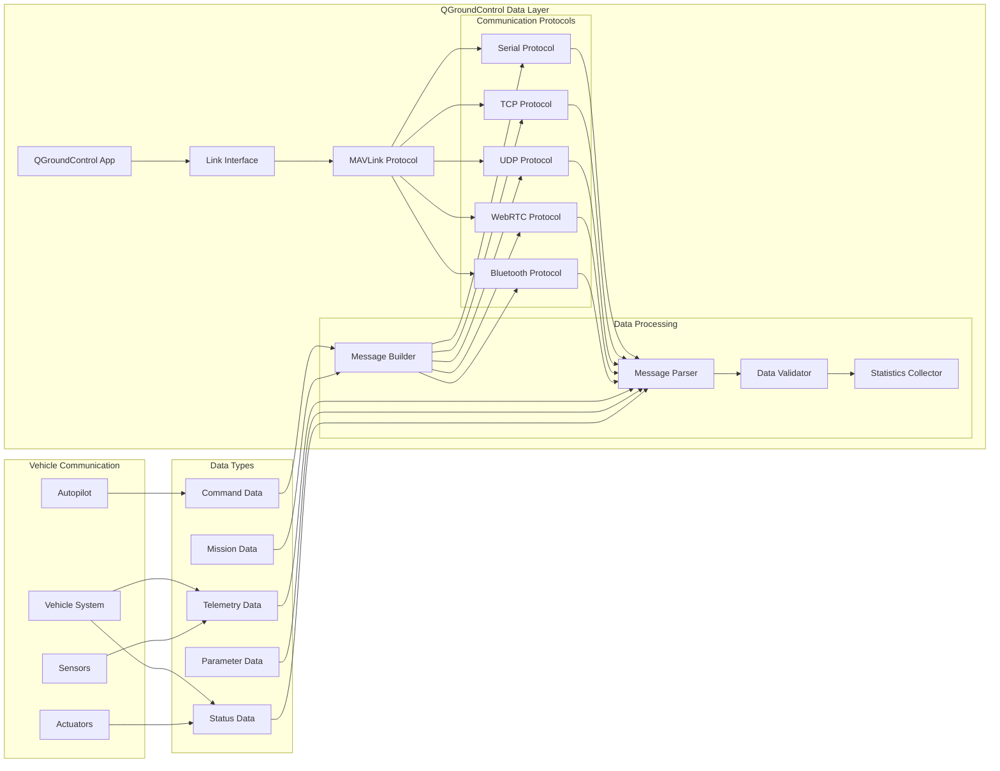
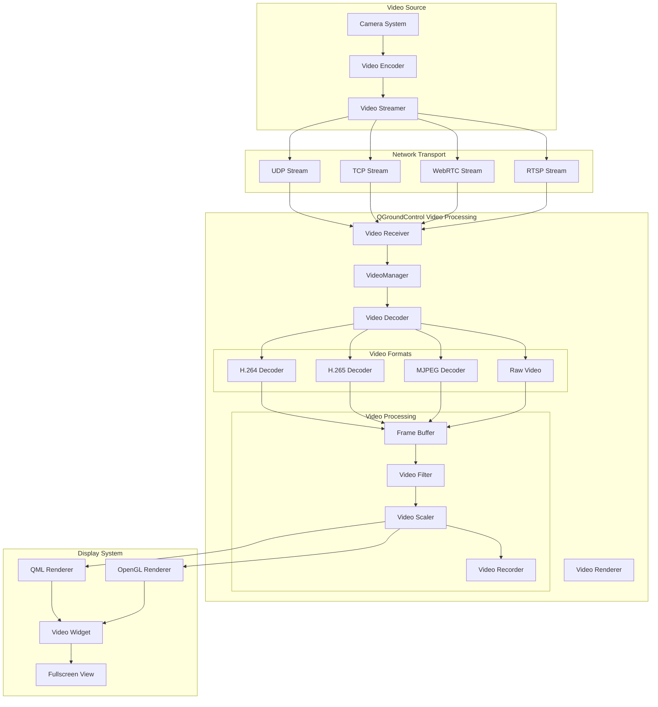
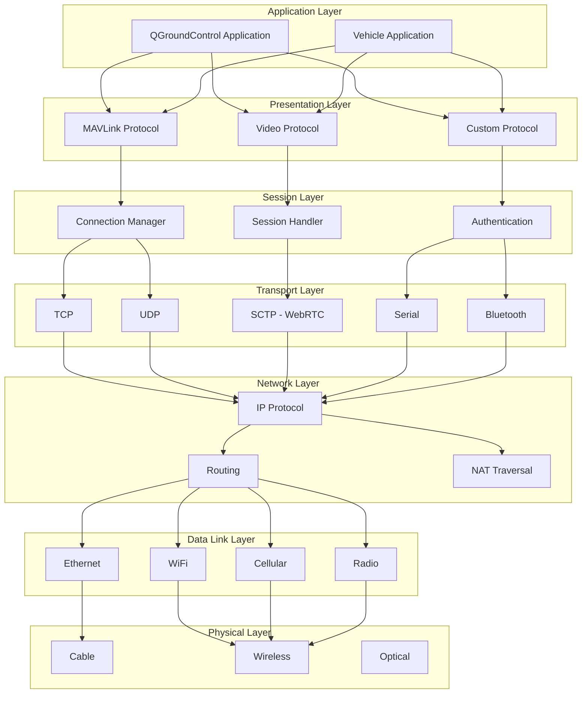
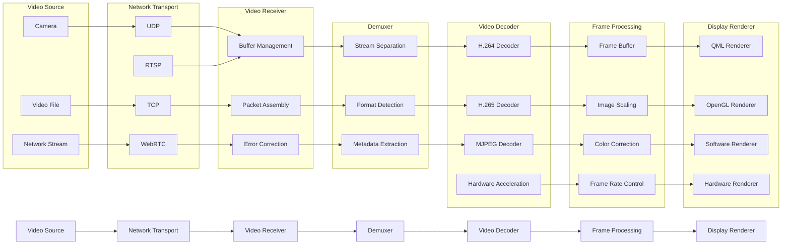
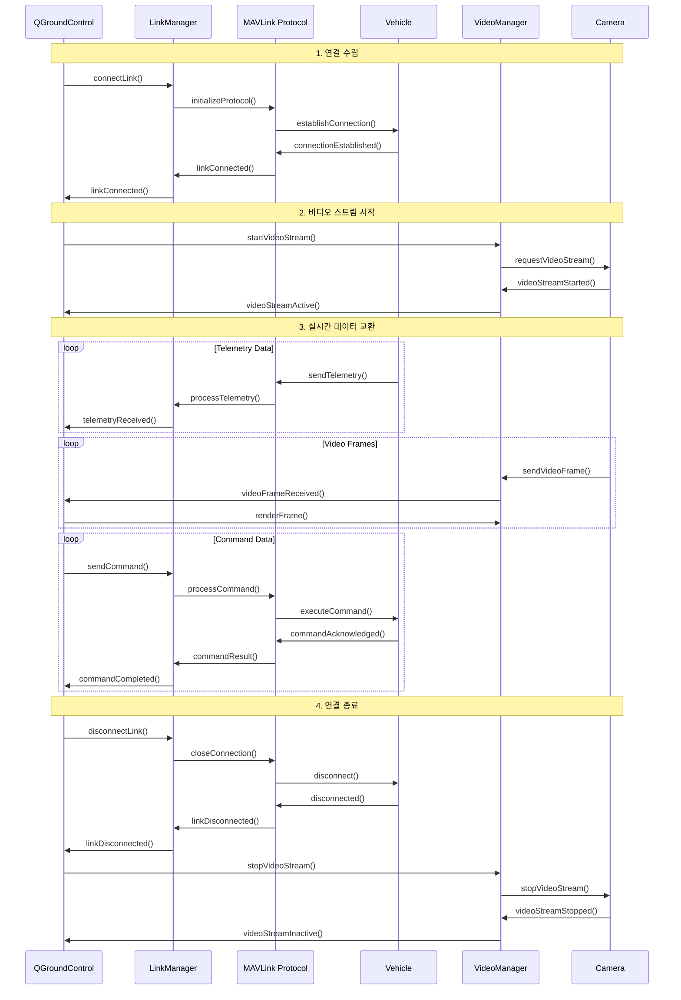
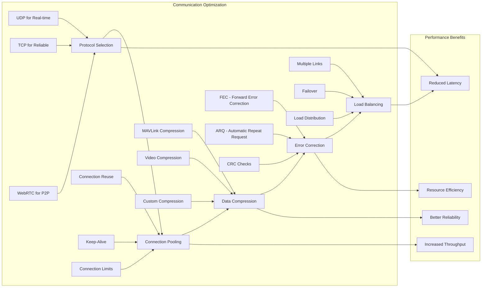
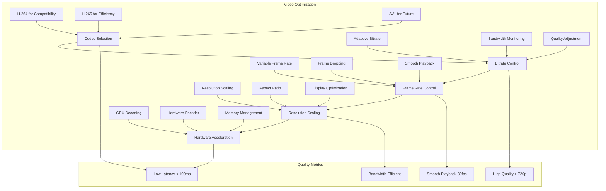

# QGroundControl 데이터 통신 및 영상 스트리밍 구조

## 목차
1. [전체 시스템 아키텍처](#전체-시스템-아키텍처)
2. [데이터 통신 구조](#데이터-통신-구조)
3. [영상 스트리밍 구조](#영상-스트리밍-구조)
4. [통신 프로토콜 계층](#통신-프로토콜-계층)
5. [비디오 처리 파이프라인](#비디오-처리-파이프라인)
6. [실시간 데이터 흐름](#실시간-데이터-흐름)
7. [성능 최적화](#성능-최적화)

---

## 전체 시스템 아키텍처

```mermaid
graph TB
    subgraph "QGroundControl Application"
        QGC[QGroundControl App]
        LinkManager[LinkManager]
        VideoManager[VideoManager]
        
        subgraph "Communication Links"
            SerialLink[Serial Link]
            TCPLink[TCP Link]
            UDPLink[UDP Link]
            WebRTCLink[WebRTC Link]
            BluetoothLink[Bluetooth Link]
        end
        
        subgraph "Data Processing"
            MAVLinkProtocol[MAVLink Protocol]
            VehicleManager[Vehicle Manager]
            MissionManager[Mission Manager]
            ParameterManager[Parameter Manager]
        end
        
        subgraph "Video Processing"
            VideoReceiver[Video Receiver]
            VideoDecoder[Video Decoder]
            VideoRenderer[Video Renderer]
            VideoRecorder[Video Recorder]
        end
    end
    
    subgraph "External Systems"
        Vehicle[Vehicle/Drone]
        Camera[Camera System]
        GCS[Ground Control Station]
        CloudServer[Cloud Server]
    end
    
    subgraph "Network Infrastructure"
        STUNServer[STUN Server]
        TURNServer[TURN Server]
        SignalingServer[Signaling Server]
        VideoServer[Video Server]
    end
    
    QGC --> LinkManager
    QGC --> VideoManager
    
    LinkManager --> SerialLink
    LinkManager --> TCPLink
    LinkManager --> UDPLink
    LinkManager --> WebRTCLink
    LinkManager --> BluetoothLink
    
    SerialLink --> MAVLinkProtocol
    TCPLink --> MAVLinkProtocol
    UDPLink --> MAVLinkProtocol
    WebRTCLink --> MAVLinkProtocol
    BluetoothLink --> MAVLinkProtocol
    
    MAVLinkProtocol --> VehicleManager
    MAVLinkProtocol --> MissionManager
    MAVLinkProtocol --> ParameterManager
    
    VideoManager --> VideoReceiver
    VideoReceiver --> VideoDecoder
    VideoDecoder --> VideoRenderer
    VideoDecoder --> VideoRecorder
    
    Vehicle --> SerialLink
    Vehicle --> TCPLink
    Vehicle --> UDPLink
    Vehicle --> WebRTCLink
    Vehicle --> BluetoothLink
    
    Camera --> VideoReceiver
    
    STUNServer --> WebRTCLink
    TURNServer --> WebRTCLink
    SignalingServer --> WebRTCLink
    VideoServer --> VideoReceiver
```

---

## 데이터 통신 구조

---

## 영상 스트리밍 구조

---

## 통신 프로토콜 계층

---

## 비디오 처리 파이프라인

---

## 실시간 데이터 흐름

---

## 성능 최적화

### 데이터 통신 최적화

### 비디오 스트리밍 최적화

### 성능 지표 모니터링

| 구성 요소 | 측정 지표 | 목표값 | 최적화 방법 |
|-----------|-----------|--------|-------------|
| **데이터 통신** | RTT | < 50ms | 프로토콜 선택, 연결 풀링 |
| **데이터 처리량** | Throughput | > 1MB/s | 압축, 다중 링크 |
| **패킷 손실률** | Packet Loss | < 1% | FEC, 재전송 |
| **비디오 지연** | Video Latency | < 100ms | 하드웨어 가속, 버퍼 최적화 |
| **비디오 품질** | Resolution | > 720p | 적응형 비트레이트 |
| **CPU 사용률** | CPU Usage | < 30% | 하드웨어 가속, 스레드 최적화 |
| **메모리 사용률** | Memory Usage | < 500MB | 메모리 풀, 가비지 컬렉션 |
| **배터리 소모** | Battery Drain | < 10%/hour | 전력 관리, 백그라운드 최적화 |

---

## 주요 기능 요약

### 1. **다중 통신 프로토콜 지원**
- **Serial**: 안정적인 직접 연결
- **TCP**: 신뢰성 높은 데이터 전송
- **UDP**: 실시간 저지연 통신
- **WebRTC**: P2P 연결 및 NAT 통과
- **Bluetooth**: 근거리 무선 통신

### 2. **MAVLink 프로토콜**
- **표준화된 메시지**: 드론 제어 표준
- **다중 메시지 타입**: 텔레메트리, 명령, 파라미터
- **버전 호환성**: MAVLink 1.0/2.0 지원
- **확장성**: 커스텀 메시지 지원

### 3. **비디오 스트리밍**
- **다중 코덱**: H.264, H.265, MJPEG
- **적응형 스트리밍**: 네트워크 상태에 따른 품질 조정
- **하드웨어 가속**: GPU 디코딩 지원
- **녹화 기능**: 실시간 비디오 저장

### 4. **실시간 처리**
- **저지연 통신**: < 50ms RTT
- **고처리량**: > 1MB/s 데이터 전송
- **안정성**: 자동 재연결, 에러 복구
- **확장성**: 다중 차량 지원

### 5. **성능 최적화**
- **메모리 관리**: 효율적인 버퍼 관리
- **CPU 최적화**: 멀티스레딩, 하드웨어 가속
- **네트워크 최적화**: 연결 풀링, 압축
- **전력 관리**: 배터리 효율성

이 도식화를 통해 QGroundControl의 데이터 통신 및 영상 스트리밍 구조를 명확히 이해할 수 있습니다.
