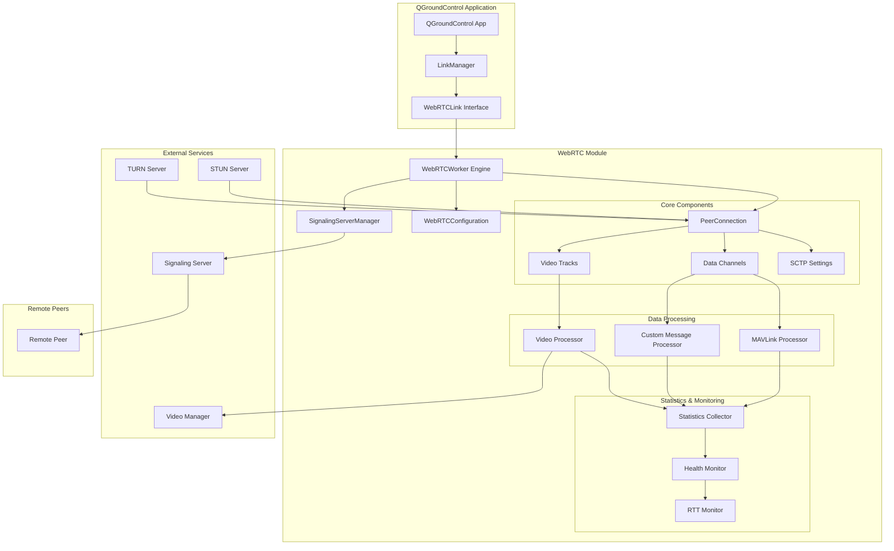
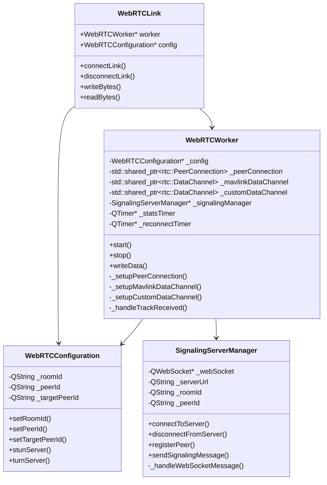
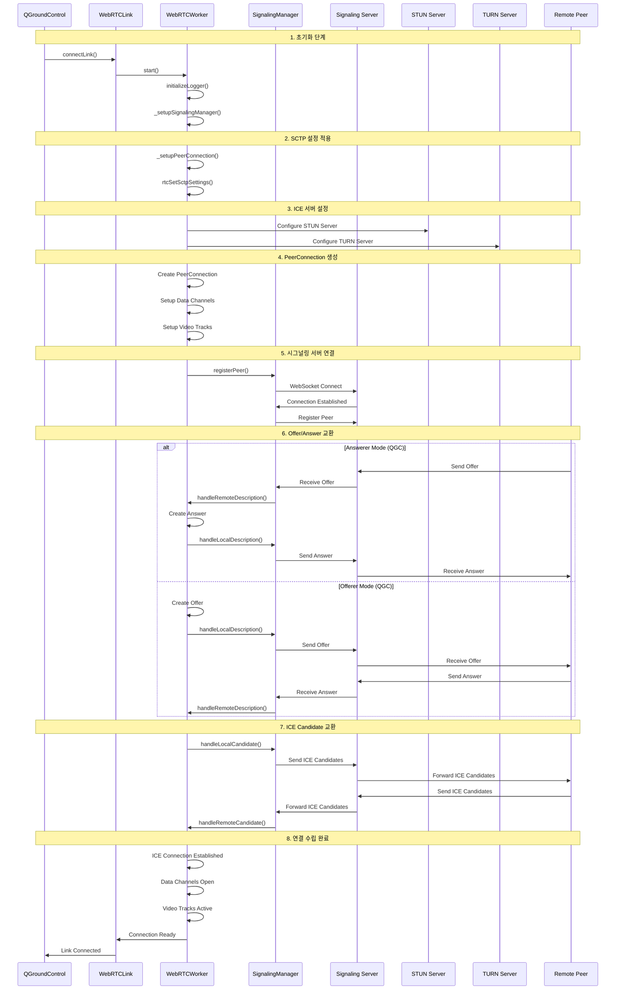
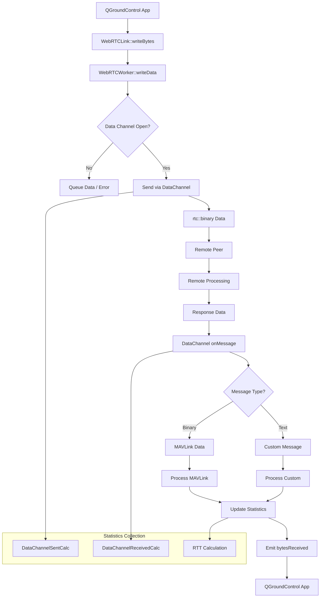
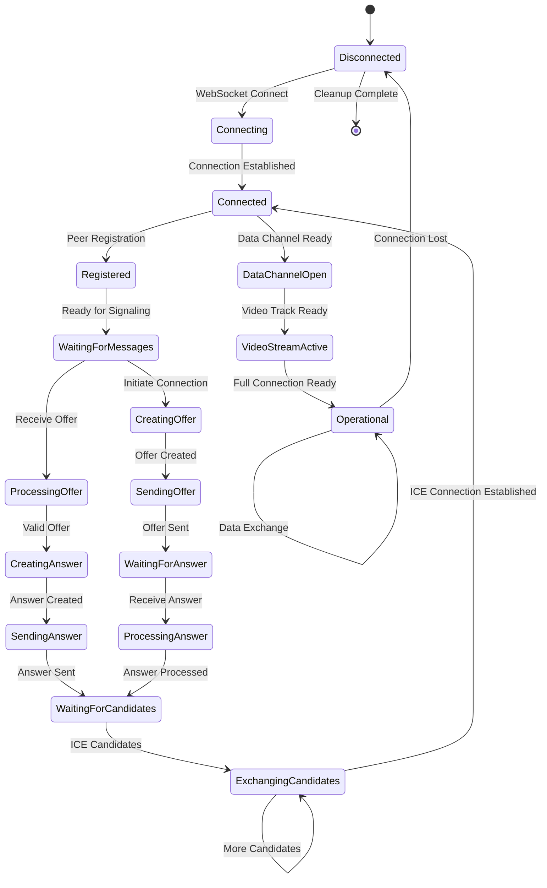
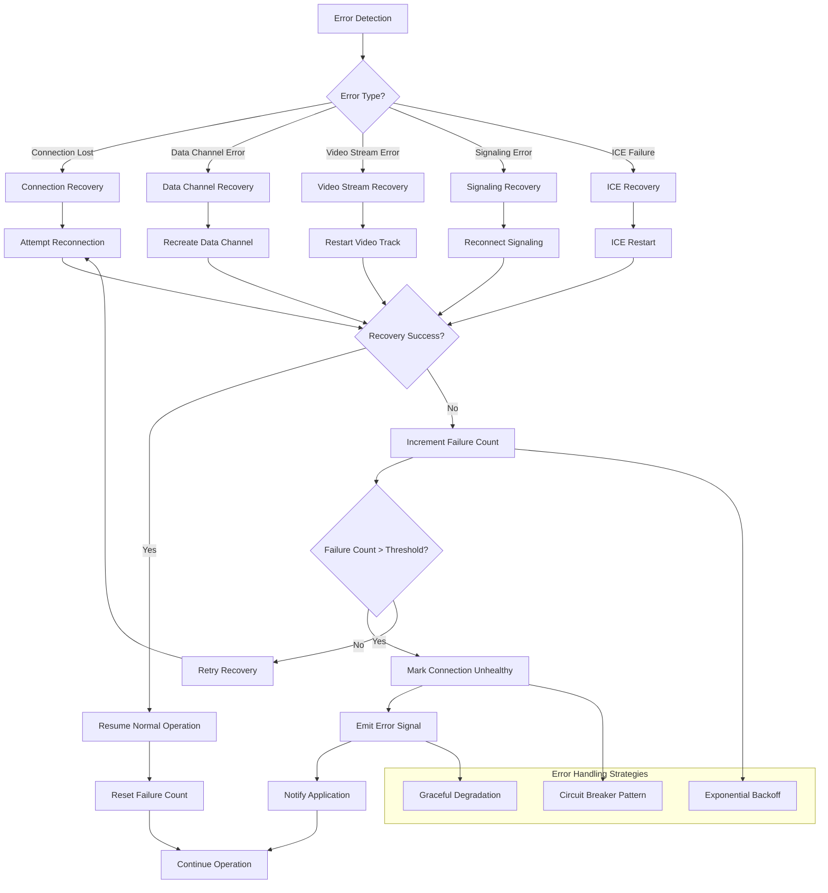
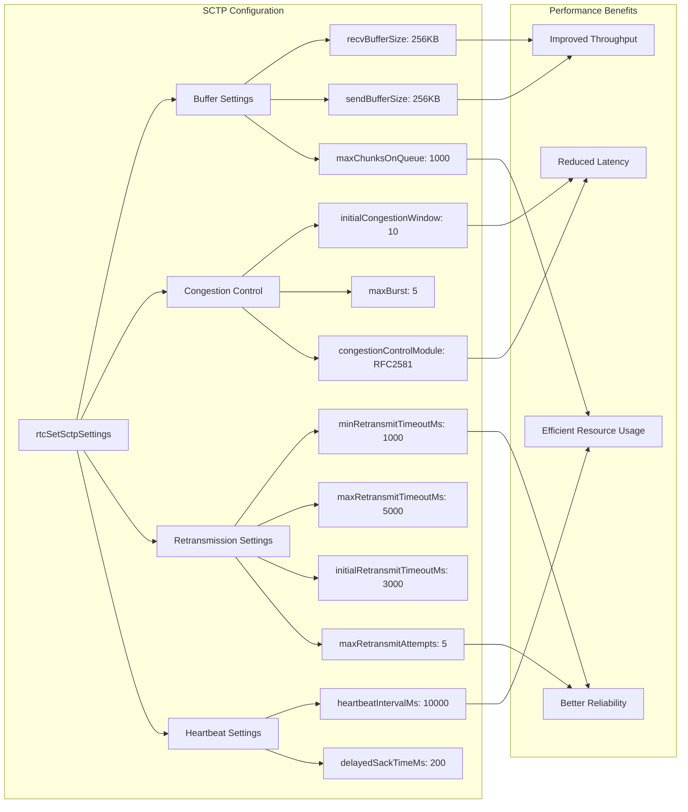

# WebRTC 모듈 로직 도식화

## 목차
1. [시스템 아키텍처](#시스템-아키텍처)
2. [클래스 구조](#클래스-구조)
3. [연결 수립 과정](#연결-수립-과정)
4. [데이터 전송 흐름](#데이터-전송-흐름)
5. [시그널링 메시지 처리](#시그널링-메시지-처리)
6. [에러 처리 및 복구](#에러-처리-및-복구)
7. [성능 최적화](#성능-최적화)

---

## 시스템 아키텍처

---

## 클래스 구조

---

## 연결 수립 과정

---

## 데이터 전송 흐름

---

## 시그널링 메시지 처리

---

## 에러 처리 및 복구

---

## 성능 최적화

### SCTP 설정 최적화

### 타이머 기반 동기화

```mermaid
gantt
    title WebRTC Timer Management
    dateFormat X
    axisFormat %L
    
    section Statistics Timer
    Stats Update    :0, 1000
    Stats Update    :1000, 1000
    Stats Update    :2000, 1000
    
    section RTT Timer
    RTT Measurement :0, 1000
    RTT Measurement :1000, 1000
    RTT Measurement :2000, 1000
    
    section Reconnect Timer
    Reconnect Check :0, 5000
    Reconnect Check :5000, 5000
    Reconnect Check :10000, 5000
    
    section Health Check
    Health Monitor  :0, 3000
    Health Monitor  :3000, 3000
    Health Monitor  :6000, 3000
```

### 성능 지표 모니터링

| 구성 요소 | 측정 지표 | 목표값 | 모니터링 방법 |
|-----------|-----------|--------|---------------|
| **연결 성능** | 연결 시간 | < 2초 | 시그널링 완료까지 시간 |
| **데이터 전송** | RTT | < 50ms | Ping/Pong 메시지 |
| **처리량** | 데이터 속도 | > 100KB/s | 바이트 카운터 |
| **품질** | 패킷 손실률 | < 5% | 시퀀스 번호 분석 |
| **안정성** | 연결 지속시간 | > 1시간 | 연결 상태 모니터링 |
| **SCTP 성능** | 버퍼 사용률 | < 80% | SCTP 통계 모니터링 |

---

## 주요 기능 요약

### 1. **다중 프로토콜 지원**
- MAVLink 데이터 채널
- 커스텀 메시지 채널
- H.264 비디오 스트림

### 2. **자동 재연결**
- 지수 백오프 알고리즘
- 회로 차단기 패턴
- 우아한 성능 저하

### 3. **실시간 모니터링**
- RTT 측정
- 처리량 계산
- 연결 상태 추적

### 4. **성능 최적화**
- SCTP 설정 튜닝
- 버퍼 크기 최적화
- 혼잡 제어 알고리즘

### 5. **에러 처리**
- 포괄적인 에러 감지
- 자동 복구 메커니즘
- 사용자 알림 시스템

이 도식화를 통해 WebRTC 모듈의 전체적인 구조와 동작 방식을 명확히 이해할 수 있습니다.
